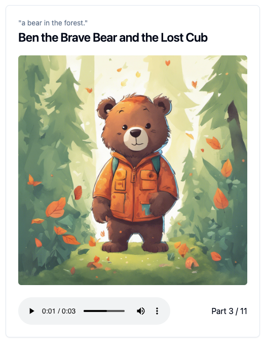
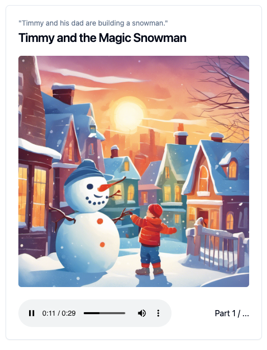

# Storyteller

StoryTeller is an exploratory web application that creates short audio stories for pre-school kids.

<table style="width:100%;">
<tr>
<td></td>
<td></td>
<td></td>
</tr>
</table>

## Example


https://github.com/lgrammel/storyteller/assets/205036/963df672-a4fc-4d0f-a74c-1e37c1246763


## Development

1. Install dependencies: `npm i`
1. Setup `.env` with required keys and base url:

   ```
    NEXT_PUBLIC_BASE_URL="http://localhost:3001"
    OPENAI_API_KEY="sk-..."
    ELEVENLABS_API_KEY="..."
    LMNT_API_KEY="..."
    STABILITY_API_KEY="sk-..."
   ```

   You can get the API keys from the respective services:

   - [OpenAI](https://platform.openai.com/)
   - [Eleven Labs](https://elevenlabs.io/)
   - [Lmnt](https://lmnt.com/)
   - [Stability](https://platform.stability.ai/)

1. Start Fastify server (runs on port 3001): `npm run fastify`
1. Start Next.js server for UI (runs on port 3000): `npm run next`
1. Go to [localhost:3000](http://localhost:3000)

## Deployment

1. Build the Next.js app: `npm run build`. This exports the app to the `out` folder, so it can be served by Fastify.

### Deploy to Render

StoryTeller can be deployed as a [Render](https://render.com/) web service.

- Build command: `npm i; npm run build`
- Start command: `npm start`
- Configure the `NEXT_PUBLIC_BASE_URL` environment variable to the Render service URL (**base url must not have trailing slash**)
- Add the API keys to the Render Environment settings.

## Used Libraries and AI services

StoryTeller is built with the following libraries:

- [ModelFusion](https://modelfusion.dev/)
- [Fastify](https://www.fastify.io/)
- [Next.js](https://nextjs.org/)
- [shadcn/ui](https://ui.shadcn.com/)
- [Zod](https://zod.dev/)

The following AI APIs are used:

- [OpenAI](https://platform.openai.com/)
- [Eleven Labs](https://elevenlabs.io/)
- [Lmnt](https://lmnt.com/)
- [Stability](https://platform.stability.ai/)

## Limitations

- No persistent execution with error handling
- No user accounts / persistent data (only storage of image and audio files)
- No user authentication / authorization
- Limited error handling on the client
- Tested on Chrome Desktop (Mac). Other browsers & operating systems may not work.
